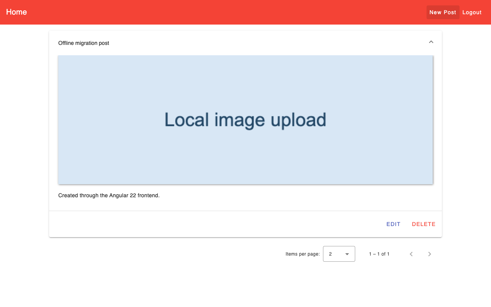
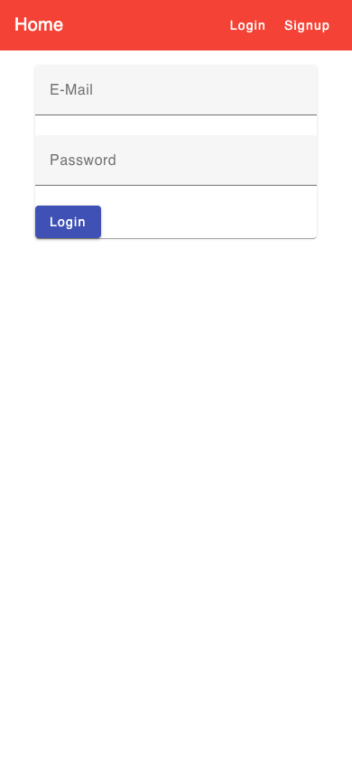

# 40-Eridani — image posts

A small publishing app for creating and browsing posts with uploaded images. The Angular frontend connects to the Express/MongoDB API in [41-Eridani](https://github.com/TheArchitect71/41-Eridani).

## What you can do

- Sign up, log in, and restore a saved login after reloading.
- Browse paginated posts with titles, text, and images.
- Create, edit, and delete your own posts.

## Preview



Captured from the running application on September 30, 2026. Any sample records shown are demonstration or isolated test data, not data included with a fresh installation.

<details>
<summary>Mobile view</summary>



</details>

## Run locally

Use the Node version in `.nvmrc` (currently 26.10.0) and npm. Run these commands from the repository root.

Start the sibling **41-Eridani** backend first, following its README. It serves the API on port 3000 and uses local MongoDB on port 27018. Clone both repositories beside one another.

```sh
nvm use  # if you manage Node with nvm
npm ci
npm start
```

Open [http://127.0.0.1:4200](http://127.0.0.1:4200). Keep the server in the foreground; stop it with **Ctrl+C**.

## Development

```sh
npm run build
npm run typecheck
npm test -- --browsers=ChromeHeadless
```

Browser tests require Chrome or Chromium; set `CHROME_BIN` if it is outside the standard installation path. Angular 22 currently requires TypeScript 6.0.x. The Jasmine 6 test dependencies are retained for compatibility with Zone.js.
